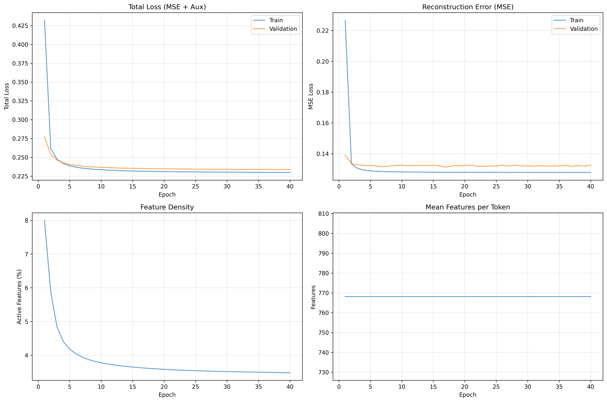
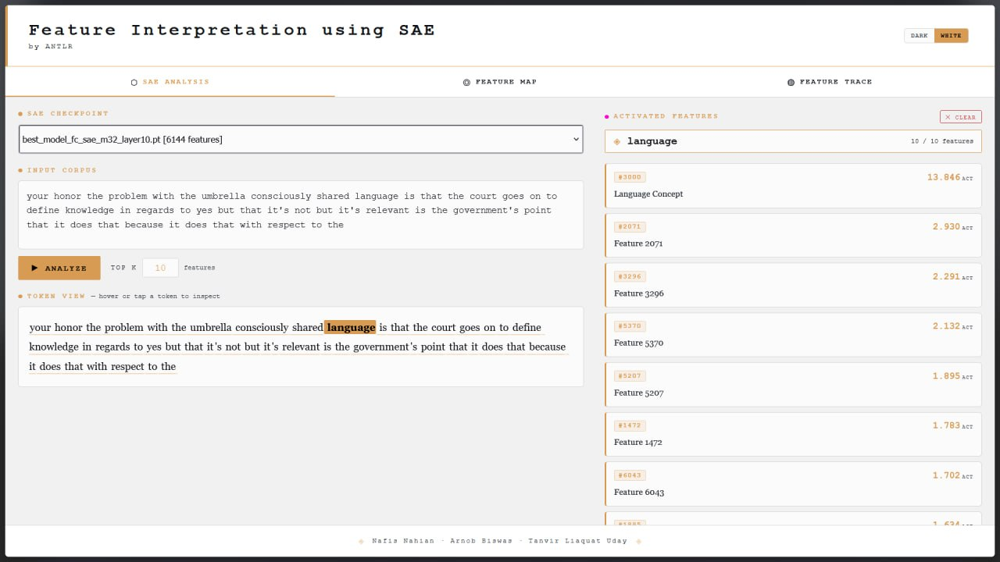
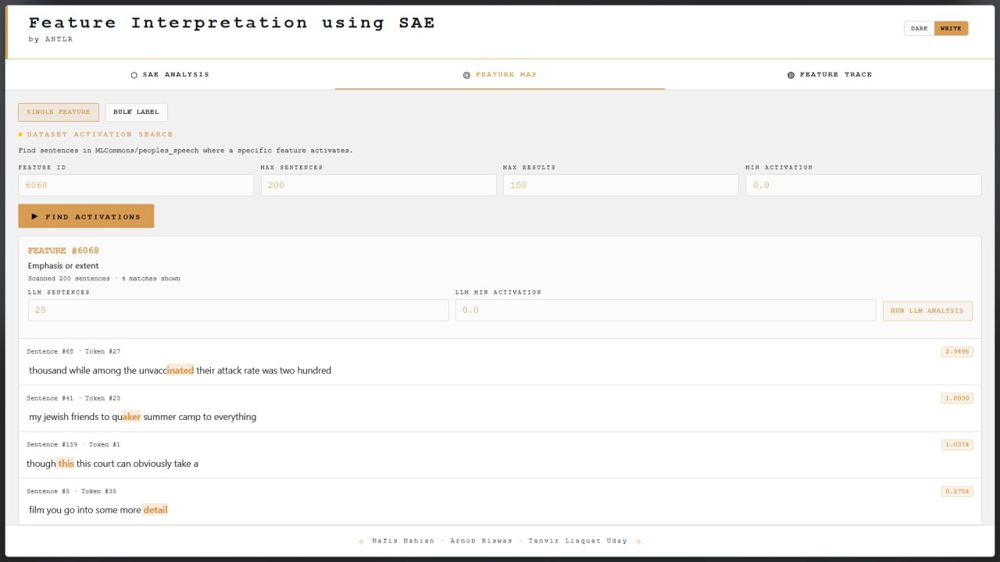
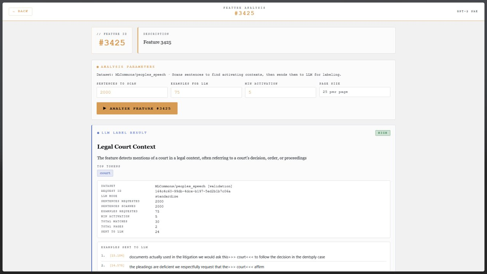
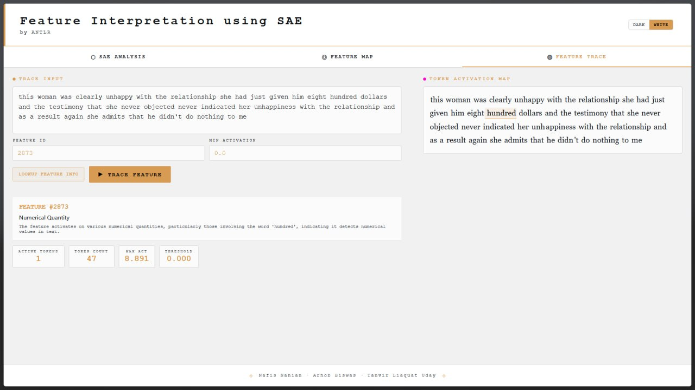

# Sparse Autoencoders for LLM Interpretability

### From superposition to monosemantic features

<!-- Based on:
- `sae_paper.pdf` (SAE survey for LLM interpretability)
- `SAE-ng.pdf` (Andrew Ng sparse autoencoder notes) -->

---

# Journey to SAE-based Model Interpretation

1. Understanding the superposition problem in LLMs
2. Collecting intuition on how SAE can help
3. Data collection and training of SAE variants
4. Architectural shift from vanilla SAE to TopK and FC_SAE
5. Training statistics and health checks
6. Results on reconstruction quality and interpretability
7. Interpretation of learned features and failure cases
8. Inference UI walkthrough for practical feature analysis

---

# 1) Superposition in LLMs

## Core issue

- LLM activations encode more concepts than available neurons
- A single neuron often responds to multiple unrelated patterns
- This is observed as **polysemanticity**

## Consequence

- Neuron-level interpretation becomes unstable and ambiguous
- Hard to assign one clean concept to one neuron

---

# Superposition Intuition

## Geometric view

- Suppose latent space has dimension $d$
- Model needs to represent $m$ concepts with $m \gg d$
- Concepts are packed as overlapping linear combinations

So observed activation vector is a mixture:

$$
z \approx \sum_{i=1}^{m} a_i f_i
$$

- $f_i$: underlying feature directions
- $a_i$: feature strengths

---

# Why This Hurts Interpretability

- Raw neuron activations are not aligned with human concepts
- A neuron can fire for different causes in different contexts
- Causal interventions at neuron level can be noisy

## Goal of SAE-based MI

- Decompose dense/polysemantic representations
- Recover sparse, more monosemantic feature activations

---

# 2) How Sparsity Solves Superposition

## Key idea: sparse dictionary coding

Learn:
- an overcomplete feature dictionary ($m > d$)
- sparse coefficients so only a few features are active per token

Then each input is reconstructed by a small active subset:

$$
z \rightarrow h(z) \rightarrow \hat{z}
$$

- Sparsity encourages feature specialization
- Specialization improves interpretability

---

# Sparse Representation Principle

Given encoder output $h(z)$:

- Most entries in $h(z)$ should be 0 (or near 0)
- Only informative features should activate

This pushes the model away from:
- "everything somewhat active"

Toward:
- "few meaningful features strongly active"

Result: cleaner feature-to-concept mapping.

---

# 3) SAE Intro: Architecture

Standard SAE components:

1. **Encoder** maps LLM activation $z \in \mathbb{R}^d$ to sparse code $h(z) \in \mathbb{R}^m$
2. **Decoder** reconstructs $\hat{z}$ from sparse code

Typical form (survey notation):

$$
\hat{z} = h(z) W_{dec} + b_{dec}
$$

- Overcomplete setting: $m \gg d$
- Decoder columns often interpreted as learned features

---

# SAE Loss (L1-Regularized Form)

From the survey's standard objective:

$$
L(z) = \|z - \hat{z}\|_2^2 + \alpha \|h(z)\|_1
$$

- Reconstruction term keeps information fidelity
- $L_1$ term enforces sparse activations
- $\alpha$ controls trade-off

## Trade-off

- High $\alpha$: more sparse, possibly worse reconstruction
- Low $\alpha$: better reconstruction, less disentanglement

---

# SAE Loss (KL Sparsity Form)

From Andrew Ng sparse AE notes:

$$
J_{sparse}(W,b) = J(W,b) + \beta \sum_{j=1}^{s_2} KL(\rho\,\|\,\hat{\rho}_j)
$$

Where:
- $\rho$: target average activation (small, e.g., 0.05)
- $\hat{\rho}_j$: empirical average activation of hidden unit $j$
- $\beta$: sparsity penalty weight

Interpretation:
- Explicitly forces each hidden unit to be rarely active on average

---

# Tuning Parameters (Practical)

## Core knobs

- Dictionary size $m$ (expansion factor)
- Sparsity strength: $\alpha$ (L1) or $(\rho, \beta)$ (KL)
- Learning rate and optimizer settings
- Batch size and token sampling strategy

## Typical tuning workflow

1. Start with stable reconstruction
2. Increase sparsity gradually
3. Track dead features and feature usage spread
4. Select checkpoint with best interpretability/reconstruction balance

---

# TopK SAE

TopK SAE enforces sparsity by selection, not by $L_1$ penalty.

Encoder idea:

$$
\tilde{h}(z) = TopK\big(W_{enc}(z - b_{pre})\big)
$$

Training objective (survey form):

$$
L(z) = \|z - \hat{z}\|_2^2 + \alpha L_{aux}
$$

- Keep only top-$K$ activations per token
- Avoids direct magnitude shrinkage from L1
- Auxiliary loss helps stabilization / dead-latent reduction

---

# FC_SAE (Feature Choice SAE)

Feature Choice SAE changes sparsity allocation direction.

Instead of:
- fixed active features per token

It enforces:
- each feature gets assigned to a controlled number of tokens

Survey statement (Ayonrinde, 2024):

$$
\sum_j S_{i,j} = m,\ \forall i
$$

- $S_{i,j}$ indicates whether feature $i$ is active for token $j$
- Promotes uniform feature utilization
- Targets dead-feature collapse directly

---

# 4) Architectural Shift: Why Move Beyond Vanilla SAE?

Reported issues in standard SAE variants:

- Shrinkage bias from $L_1$ penalties
- Dead latents (features that never activate)
- Rigid sparsity allocation

New architectures aim to keep:
- strong reconstruction
- sparse features
- healthier feature utilization

---

# Architectural Comparison (Quick)

| Variant | Sparsity mechanism | Strength | Main concern |
|---|---|---|---|
| Vanilla SAE | $L_1$ on activations | Simple and standard | Shrinkage bias |
| TopK SAE | Hard top-$K$ per token | Direct control, cleaner sparsity | Choosing good $K$ |
| FC_SAE | Token allocation per feature | Better feature usage | More complex assignment dynamics |

---

# 5) Training Statistics — Big Picture

- Training settles into a stable pattern instead of bouncing around wildly
- Early epochs do most of the heavy lifting, later epochs are mostly polish
- This is the point where we can start tuning for interpretability, not just reconstruction

---

# 5a) Training Health Check

- Dead-feature ratio is the "are we wasting neurons?" dashboard
- The trend suggests feature usage is becoming healthier over time
- If this shot up too much, we'd dial back sparsity or adjust learning rate

---

# 5b) Feature Density Snapshot

- Most activations stay near zero, which is exactly what sparse coding wants
- A smaller set of features carries strong signal when needed
- In plain terms: fewer features talk, but when they do, they say something useful

---

# 5c) Full Training Curves

- This gives the complete training-story timeline in one view
- Curves are smooth enough to trust the run, not just one lucky batch
- Good checkpoint zone: where reconstruction is stable and feature usage looks balanced

---

# 6) Results — Reconstruction Quality

- Reconstructed activations track the original signal closely
- The model keeps key information while still enforcing sparsity
- Nice practical takeaway: we are not paying a huge quality tax for interpretability

---

# 6a) Results — Variant Comparison

- Vanilla SAE, TopK SAE, and FC_SAE each land at different trade-off points
- TopK/FC-style designs look more consistent on feature usage behavior
- If we care about cleaner features, these newer variants are worth the extra complexity

---

# 6b) Results — Case-Level Example

- Token-level view makes differences easier to trust than aggregate metrics alone
- We can see where sparsity helps and where reconstruction still misses details
- This is the kind of slide that makes results feel concrete in discussion

---

# 7) Interpretation — Feature Families

- Features naturally cluster into themes (syntax, numbers, legal, emphasis, etc.)
- This is where monosemantic behavior starts to become visible
- Labeling gets much easier once these families emerge consistently

---

# 7a) Interpretation — Failure Case

- Not every feature is clean; some still mix multiple concepts
- These are useful warning signs, not bad news
- They tell us where to retune sparsity or inspect data coverage

---

# 7b) Interpretation — Activation Evidence

- Matched examples help verify whether a label is actually grounded
- If examples are coherent, confidence goes up quickly
- If examples are messy, we treat the feature as ambiguous and keep investigating

---

# 8) Inference UI — Overview

The inference UI (by ANTLR) has **three main tabs**:

| Tab | Purpose |
|---|---|
| **SAE Analysis** | Input text → see top-K activated features per token |
| **Feature Map** | Search/label features across the full dataset |
| **Feature Trace** | Trace a specific feature ID over any input text |

Built on top of GPT-2 SAE checkpoints (e.g. `best_model_fc_sae_m32_layer10.pt`)

---

# 8a) SAE Analysis — Token-level Feature Inspection

- User pastes any input text and clicks **Analyze**
- Hovering/tapping a token shows its **top-K activated features** on the right
- Here, token `language` → top feature `#3000: Language Concept` (activation **13.846**)
- Remaining features (#2071, #3296 …) show lower but non-trivial activations

---

# 8b) Feature Map — Dataset Activation Search

- Given a **Feature ID**, scans the dataset (MLCommons/peoples_speech) for activating sentences
- Feature **#6068** labelled *"Emphasis or extent"* — found 4 matches in 200 sentences
- Highlighted token per sentence shows **exactly which token triggered** the feature
- Supports **Bulk Label** mode to label many features at once via LLM

---

# 8c) Feature Analysis — LLM Auto-labeling

- For any feature, the system sends top-activating examples to an LLM for **automatic labeling**
- Feature **#3425** → labelled *"Legal Court Context"* with confidence **HIGH**
- Top token: `court` — consistent across all matched sentences
- Parameters: sentences to scan, examples sent to LLM, min activation threshold

---

# 8d) Feature Analysis — Activation Examples

- Matched sentences displayed with `>>>token<<<` notation marking the activating token
- Each example has a **prompt-aligned activation score** (e.g. 15.10, 14.58 …)
- Enables manual verification of the LLM-assigned label
- Useful for catching mislabeled or polysemantic features

---

# 8e) Feature Trace — Single-feature Token Heatmap

- Input text + Feature ID → highlights **which tokens** activate that feature
- Feature **#2873** (*"Numerical Quantity"*) fires on token `hundred` in the sentence
- Right panel: **Token Activation Map** with underline intensity as a visual cue
- Stats shown: active tokens, token count, max activation, threshold

---

# Closing

- Superposition motivates feature-level decomposition
- Sparsity makes decomposition practical and interpretable
- SAE family evolves from L1-based to allocation-aware designs
- TopK SAE and FC_SAE reflect this architectural shift

---

# References

- To be added

Thank you.